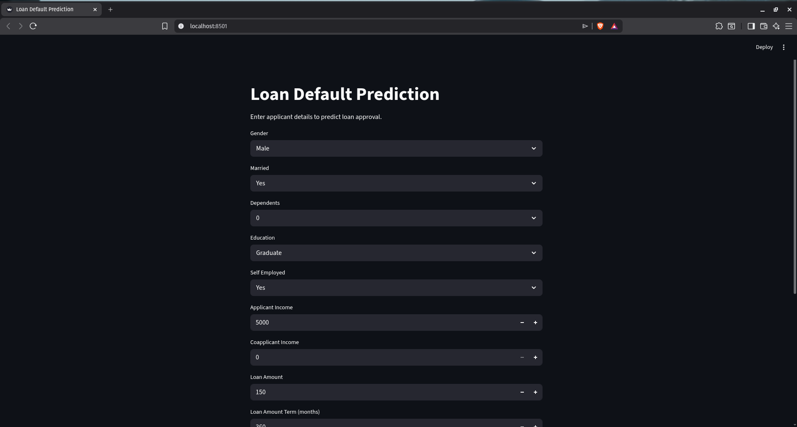
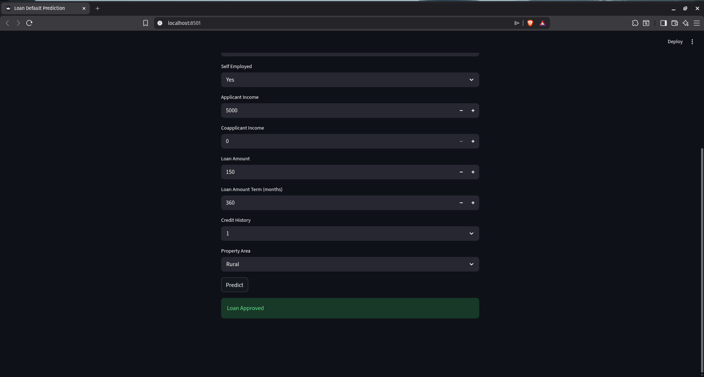

# loan-default-prediction
This project aims to predict whether a loan applicant is likely to default using machine learning classification techniques.

Financial institutions face significant risk when approving loans, especially if applicants fail to repay. This system helps identify high-risk applicants based on factors such as income, loan amount, credit history, and other attributes.

Multiple models are trained and evaluated using metrics like accuracy, precision, recall, and F1-score, with a focus on reducing risky approvals. The project also includes data visualization, preprocessing, and cross-validation to ensure robust and reliable performance.

Data source: https://www.kaggle.com/code/yonatanrabinovich/loan-prediction-dataset-ml-project/notebook

## Business Interpretation

- Credit History is the most important factor for loan approval. Applicants with a good credit history have a much higher chance of getting their loan approved.
- Applicant Income also plays a significant role. Higher and stable income generally increases the approval probability.
- Loan Amount influences the decision, as larger loan requests are comparatively harder to approve.
- Features like Education, Married status, and Self Employment had relatively low impact on the final prediction.
- Among all the models tested, Logistic Regression achieved the best overall performance, making it the final model selected for deployment.

## Project Analysis

- The dataset showed moderate class imbalance, with loan approvals occurring more frequently than rejections.
- Credit history appeared to be one of the strongest factors influencing loan approval decisions.
- Applicant income distribution was highly right-skewed with some large outliers.
- Correlation analysis showed generally weak relationships between most numerical features.
- Insights from EDA were used to guide preprocessing and model development.

### EDA Visualizations

#### Loan Status Distribution

#### Credit History vs Loan Status

#### Applicant Income Distribution

#### Correlation Heatmap

## Model Comparison

| Model | Test Accuracy | Test F1 Score | CV Accuracy | CV F1 Score | Overall |
|:------|--------------:|--------------:|------------:|------------:|:--------|
| Logistic Regression | **86.18%** | **90.81%** | **80.78%** | **87.55%** | Best |
| Random Forest | 82.11% | 87.64% | 78.34% | 85.54% | Good |
| XGBoost | 80.49% | 79.00% | 75.57% | 83.07% | Acceptable |

## Streamlit Demo

### Input Form

### Prediction Result

## Installation

git clone <https://github.com/kirmada67-dot/loan-default-prediction.git>

cd loan-default-prediction

pip install -r requirements.txt

streamlit run src/app.py

## Changelog

### V3
- Refactored preprocessing into `preprocess.py`.
- Added modular training pipeline in `train.py`.
- Trained and saved Logistic Regression, Random Forest, and XGBoost models.
- Implemented `predict.py` for inference using saved models.
- Added a simple Streamlit application for interactive loan prediction.

### v2 — Model Comparison & Advanced Evaluation
- Added Random Forest Classifier for model comparison
- Implemented classification metrics: Precision, Recall, and F1-score
- Added confusion matrix visualization and analysis
- Implemented 5-fold cross-validation for model stability evaluation
- Added feature importance analysis using Random Forest
- Compared model generalization and overfitting behavior
- Finalized Logistic Regression as best-performing model

### v1 — Logistic Regression Baseline
- Added EDA with matplotlib and seaborn visualizations
- Handled missing values and categorical encoding
- Implemented train-validation split with stratification
- Trained baseline Logistic Regression classifier
- Added evaluation metrics and confusion matrix analysis
- Added project insights and EDA screenshots to README

## Key Learnings

- Performed exploratory data analysis using Matplotlib and Seaborn.
- Built multiple classification models and compared their performance.
- Evaluated models using Accuracy, Precision, Recall, F1-score, and Cross Validation.
- Created a modular ML pipeline with preprocessing, training, inference, and deployment.
- Built a simple Streamlit application for real-time predictions.
