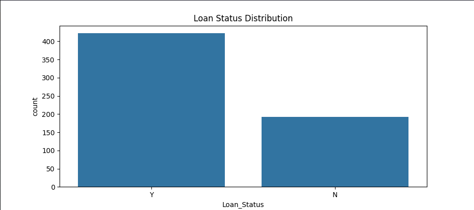
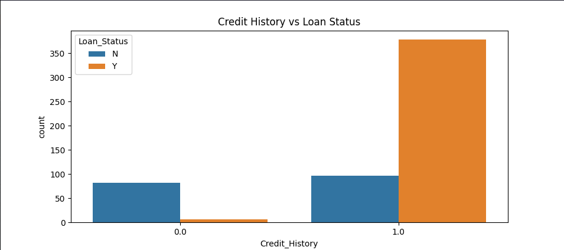
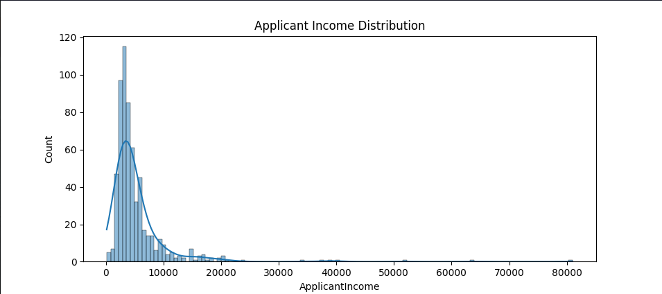
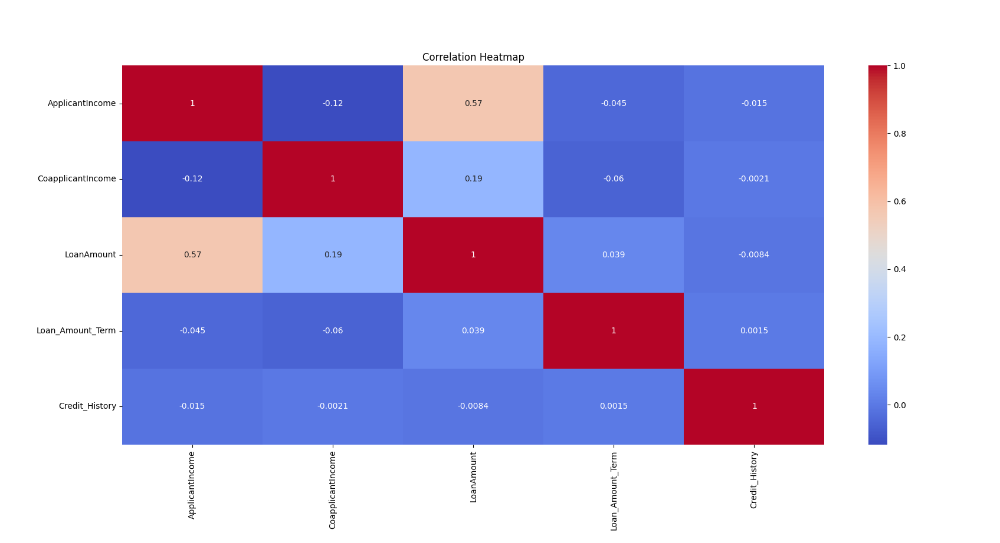

# loan-default-prediction
This project aims to predict whether a loan applicant is likely to default using machine learning classification techniques.

Financial institutions face significant risk when approving loans, especially if applicants fail to repay. This system helps identify high-risk applicants based on factors such as income, loan amount, credit history, and other attributes.

Multiple models are trained and evaluated using metrics like accuracy, precision, recall, and F1-score, with a focus on reducing risky approvals. The project also includes data visualization, preprocessing, and cross-validation to ensure robust and reliable performance.

Data source: https://www.kaggle.com/code/yonatanrabinovich/loan-prediction-dataset-ml-project/notebook

## Project Analysis

- The dataset showed moderate class imbalance, with loan approvals occurring more frequently than rejections.
- Credit history appeared to be one of the strongest factors influencing loan approval decisions.
- Applicant income distribution was highly right-skewed with some large outliers.
- Correlation analysis showed generally weak relationships between most numerical features.
- Insights from EDA were used to guide preprocessing and model development.

### EDA Visualizations

#### Loan Status Distribution

#### Credit History vs Loan Status

#### Applicant Income Distribution

#### Correlation Heatmap

